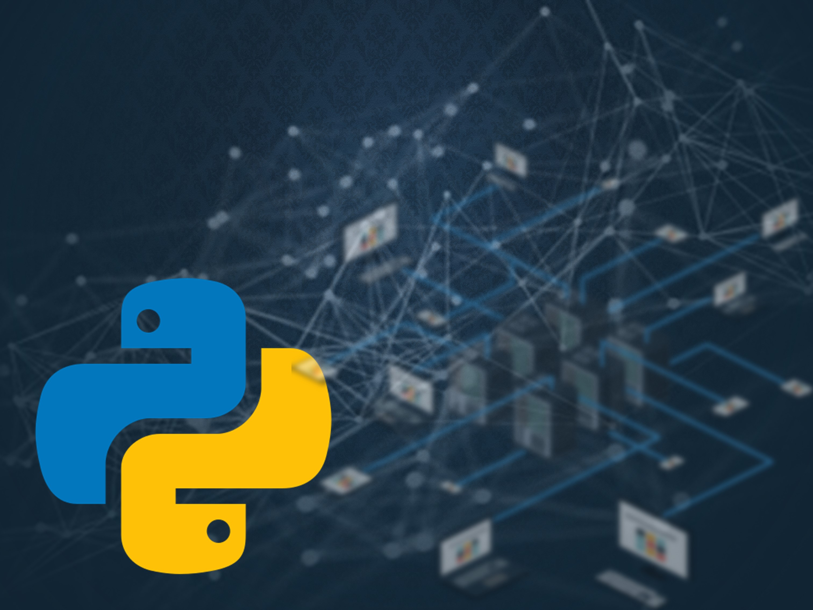
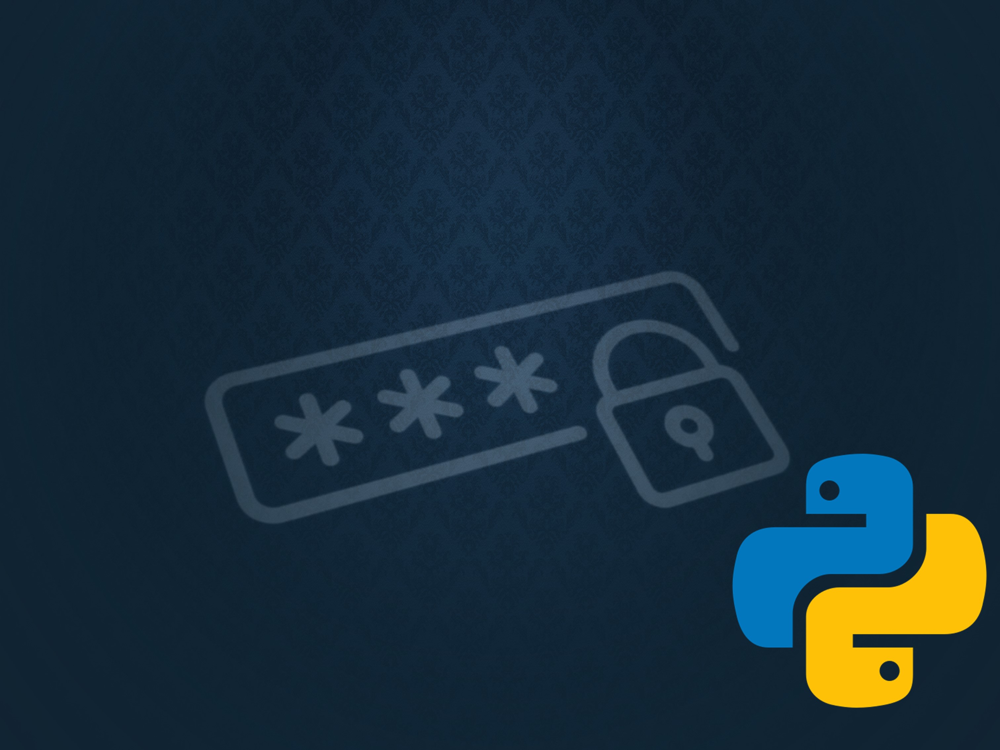

    

<!-- Welcome profile -->

<h1 align="center">👋 Hola! <a href="https://cbenitez.net">Soy Carlos Benitez</a></h1>

<!-- Profile views -->
 

	 

	

<!-- About Me -->

<h1 align="center"></picture>Sobre Mi</h1>

<picture> </picture>

 

- 🌐 Trabajo en la **administración y soporte de infraestructuras, con experiencia en redes, gestión de VPNs, firewalls y monitoreo de tráfico**.
- 🐍 Utilizo Python para automatizar **tareas de gestión, monitoreo y mejora de infraestructuras**.
- 🌱 Estoy mejorando mis **habilidades en programación y desarrollo de aplicaciones con Python**.
- 🔭 Tengo un gran interés en el desarrollo con `Python`, por lo que estoy aprendiendo más sobre **Automatización y Machine Learning**.
- 💻 Me apasiona la resolución de problemas y el `proceso de transformar ideas en soluciones prácticas`.
- 📝 Siempre `aprendiendo nuevas cosas`.
- ✍️ En mi tiempo libre, escribo artículos sobre tecnología y desarrollo en [Medium](https://medium.com/@cbenitez191).
- 📫 No dude en ponerse en contacto conmigo en **cbtech.sec@proton.me**.

  

<!-- My Repositories -->

<h1 align="center">:open_file_folder: Proyectos</h1>

<table>
<tr>
<td width="50%">
<h3 align="center">Herramientas Ciberseguridad</h3>

En este proyecto, compartiré con ustedes una selección de <strong>videos y código</strong> que cubren temas relacionados con la seguridad informática. Es importante tener en cuenta que el contenido proporcionado en este proyecto es para fines educativos y de divulgación.

                                                                                      
</td>

<td width="50%">
<h3 align="center">Notas Ethical Hacking</h3>

                                       

 

Este repositorio alberga una <strong>colección de notas y recursos relacionados con el hacking ético</strong>, enfocándose en la seguridad informática y la resolución de problemas. Donde compartire conocimientos, técnicas y herramientas de hacking, así como las experiencias.

                                                             
</table>                                                                                 

</td>

<table>
<tr>
<td width="50%">
<h3 align="center">Escaneo de Puertos con Python</h3>

Este proyecto utiliza <strong>Python y la biblioteca scapy </strong>para realizar un escaneo de puertos en una red. El objetivo es detectar los puertos abiertos en un objetivo y determinar que servicios especificos están utilizando. Identificación de servicios asociados a los puertos abiertos ( HTTP, FTP, SSH, SQL, etc)

                                                                                      
</td>       

<td width="50%">
<h3 align="center">Generador de Contraseñas</h3>

Este proyecto utiliza Python y la biblioteca <strong>secrets</strong>para generar contraseñas únicas. El objetivo es crear una herramienta que pueda ser utilizada para generar contraseñas fuertes y complejas, adecuadas para proteger cuentas de usuarios en línea. Algoritmos de criptografía para contraseñas seguras.

                                                                                   
</td>  
</table>

 

<!-- GitHub Analytics -->
<h1 align="center"><picture>   </picture>Desarrollo de Proyectos</h1>
  

<!-- Contact with me -->
 
<h1 align="center"><picture>   </picture>Contacto</h1>

 

        
        
        
		
  

 

------

  :rocket: ¡Gracias por ver mi perfil! ¡Que tengas un buen día! :sunglasses:  
  &copy; 2024 Carlos Benitez

